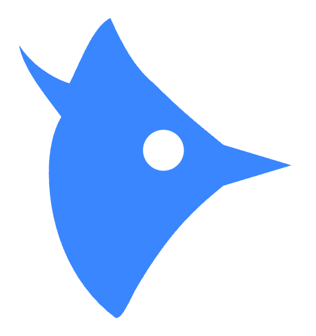
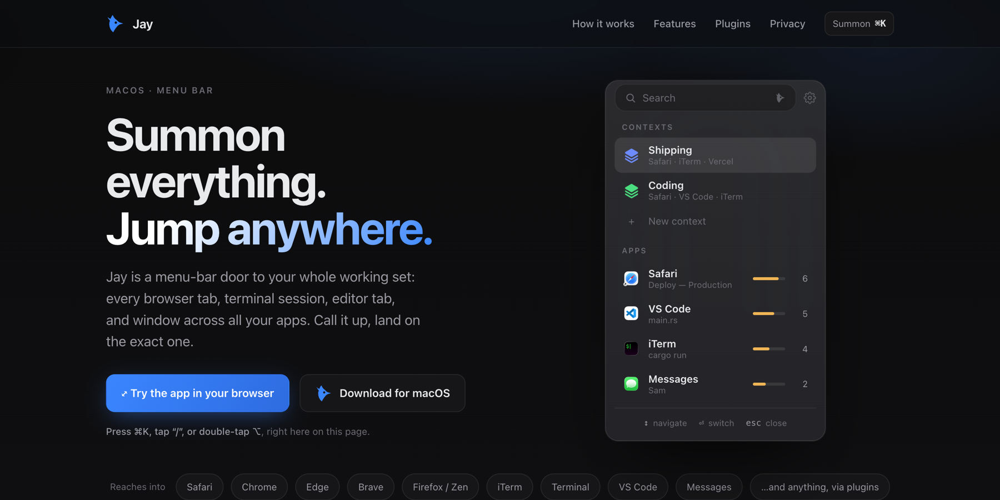

<p align="center"></p>
<h1 align="center">Jay</h1>
<p align="center"><b>Summon everything, jump anywhere.</b></p>
<p align="center">
  <a href="https://spacegrowth.github.io/jay/"><b>Website</b></a> &nbsp;·&nbsp;
  <a href="https://github.com/spacegrowth/jay/releases/latest/download/Jay-Installer.pkg"><b>Download for macOS</b></a>
</p>



Jay is a macOS menu-bar launcher. Double-tap ⌥ (or flick your cursor to the screen edge) and it lists every open tab, terminal session, and window across your apps. Type a few letters, press return, and you land on the exact one.

## Highlights

- **Down to the tab.** Individual browser tabs, terminal sessions, and editor tabs, not just apps and windows.
- **On-device Contexts.** Related tabs and sessions are grouped into workspaces on your Mac. On macOS 26+, Apple's local model names each workspace; older systems use a built-in labeler. Nothing leaves your Mac.
- **Extensible by plugins.** Reach a simple app in ~20 lines, in any language. Out-of-process, with a hard timeout; installed plugins are on by default and disable with one toggle.
- **No phone-home.** The only network call is a site-icon lookup (DuckDuckGo/Google), and you can switch it off in Preferences. With it off, the app makes no network calls at all.

## Build

```sh
cd app && ./build.sh      # builds and ad-hoc signs the app
open app/*.app
```

Grant Accessibility when prompted. Automation prompts appear per app the first time Jay reads one.

## Plugins

A plugin is a folder with a `plugin.json` and an executable that speaks JSON over two commands, `list` and `activate`. See [`plugins/README.md`](plugins/README.md) for the contract, and `plugins/terminal` and `plugins/vscode` as working examples.

## Site

`site/` is the landing page (a single self-contained HTML file, GitHub Pages ready).

## Status

A personal project, shared as-is. No support guaranteed. Contributions are welcome; issues may sit.

## License

MIT. See [LICENSE](LICENSE).
